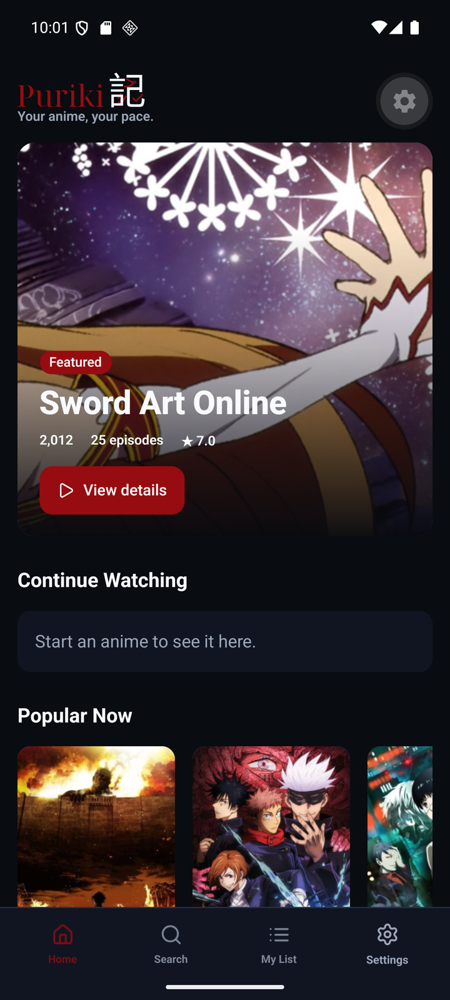
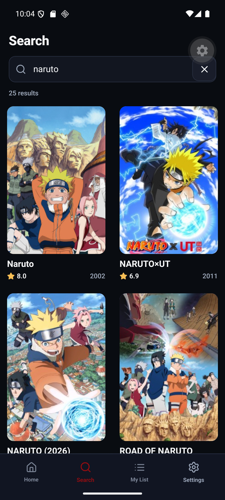
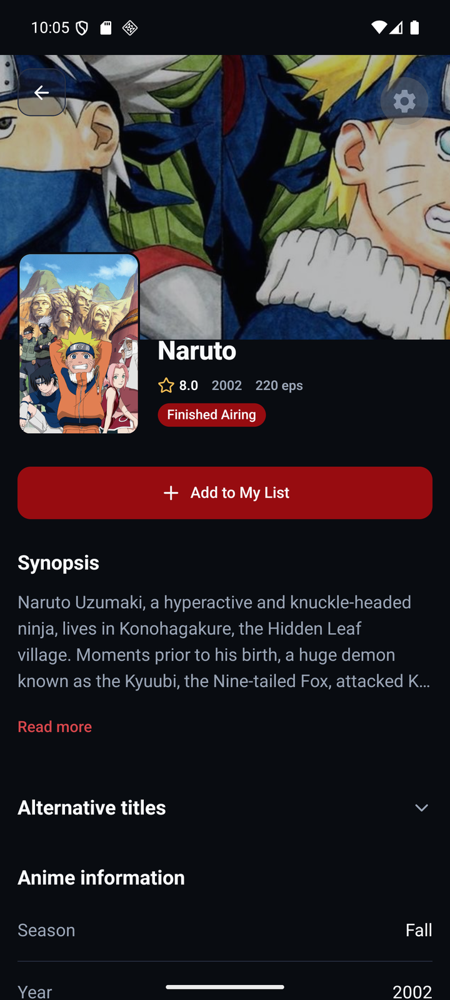
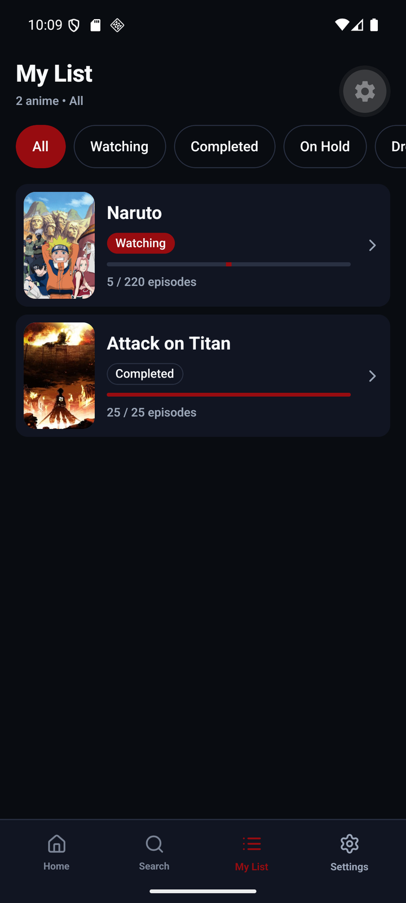
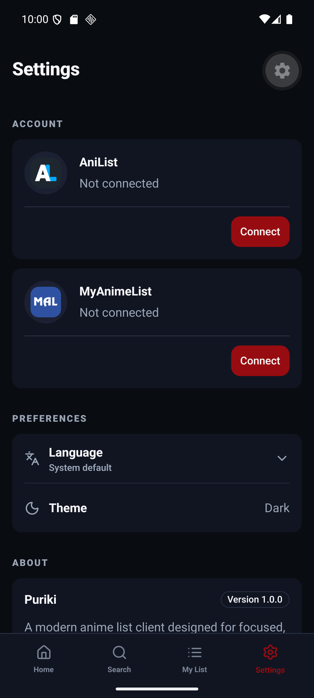

# Puriki

<p align="center">
  <picture>
    <source media="(prefers-color-scheme: dark)" srcset="../../assets/brand/svg/puriki-horizontal-dark.svg">
    
  </picture>
</p>

<p align="center">
  Um cliente Android gratuito e sem anúncios para listas de anime do AniList e MyAnimeList.
</p>

<p align="center">
  <a href="../../README.md">English</a> ·
  <strong>Português (Brasil)</strong> ·
  <a href="./README.es.md">Español</a>
</p>

O Puriki oferece aos fãs de anime uma experiência Android focada para descobrir
títulos e administrar a lista que já mantêm no AniList ou MyAnimeList. Conecte
um dos provedores, escolha a lista ativa quando ambos estiverem conectados ou
experimente o aplicativo no modo visitante.

[Site oficial](https://jvitorn.github.io/puriki-site/) ·
[GitHub Releases](https://github.com/jvitorn/puriki/releases) ·
[Roadmap do produto](../../PURIKI_PRODUCT_ENGINEERING_ROADMAP.md)

## Recursos

- Descubra animes populares, da temporada, futuros e em destaque.
- Pesquise no catálogo e abra páginas detalhadas com sinopse, estúdios,
  gêneros, continuidade e onde assistir quando os provedores disponibilizarem
  esses dados.
- Conecte uma conta do AniList ou MyAnimeList.
- Consulte a lista do provedor selecionado e adicione ou remova títulos.
- Atualize episódios assistidos, status da lista e nota.
- Mantenha o progresso dentro do limite de episódios lançados quando essa
  informação estiver disponível.
- Use uma lista temporária no modo visitante sem conectar uma conta.
- Continue navegando com fallback entre provedores e cache do catálogo durante
  falhas elegíveis de serviço.
- Use a interface em inglês, português do Brasil ou espanhol.
- Traduza sinopses em inglês para português ou espanhol no Android, sob demanda,
  usando o Google ML Kit no próprio dispositivo.

O Puriki 1.0 administra uma lista de provedor selecionada por vez. Ele **não**
copia nem sincroniza continuamente listas entre AniList e MyAnimeList.

## Serviços compatíveis

| Serviço        | Dados de descoberta             | Conexão de conta | Administração da lista                             |
| -------------- | ------------------------------- | ---------------- | -------------------------------------------------- |
| AniList        | Fonte primária do catálogo      | OAuth            | Leitura, adição, remoção, progresso, status e nota |
| MyAnimeList    | Fallback automático do catálogo | OAuth com PKCE   | Leitura, adição, remoção, progresso, status e nota |
| Modo visitante | Usa o catálogo disponível       | Não necessária   | Lista temporária durante o processo do app         |

A disponibilidade dos provedores e a completude de cada título dependem dos
dados expostos pelo AniList e MyAnimeList.

## Capturas de tela

Veja o Puriki em funcionamento no Android.

<p align="center">
  <a href="./screenshots/home.png"></a>
  <a href="./screenshots/search.png"></a>
  <a href="./screenshots/anime-details.png"></a>
  <a href="./screenshots/my-list.png"></a>
  <a href="./screenshots/settings.png"></a>
</p>

## Download

O Puriki 1.0 é distribuído diretamente como APK para Android. O primeiro APK
público será disponibilizado na página oficial de
[GitHub Releases](https://github.com/jvitorn/puriki/releases) com o nome:

```text
puriki-v1.0.0.apk
```

O Puriki não é distribuído pela Google Play. A documentação não considera a
versão publicada até que o GitHub Release e seu APK assinado existam de fato.

## Instalação no Android

1. Baixe o APK no GitHub Release oficial do Puriki.
2. Abra o arquivo baixado no dispositivo Android.
3. Se o Android solicitar, permita instalações pelo navegador ou gerenciador de
   arquivos utilizado.
4. Confirme a instalação.

O Android pode avisar que o aplicativo veio de fora da Google Play. Confira o
nome do arquivo e a página do release antes de instalar. APKs futuros podem ser
instalados sobre o aplicativo atual quando usarem a mesma chave de assinatura e
um `android.versionCode` maior.

## Privacidade e segurança

- O Puriki não possui serviço de conta próprio nem backend hospedado pelo
  projeto com uma cópia da sua lista de anime.
- Tokens OAuth do AniList e MyAnimeList são armazenados no dispositivo com Expo
  SecureStore.
- A build de produção usa apenas IDs públicos dos clientes OAuth. Segredos de
  cliente não devem ser colocados em variáveis `EXPO_PUBLIC_*` nem incluídos
  no aplicativo.
- Idioma, estado do onboarding, provedor selecionado, cache de tradução e dados
  operacionais semelhantes podem ser armazenados localmente.
- O conteúdo da lista visitante existe somente durante o processo atual do
  aplicativo e pode ser perdido quando ele reinicia.
- O Puriki 1.0 não inclui SDK de anúncios nem backend próprio de analytics.
- A tradução no dispositivo pode baixar modelos de idioma do Google ML Kit,
  mas o texto da sinopse não é enviado a um servidor do Puriki.

AniList, MyAnimeList, Google ML Kit, GitHub e EAS são serviços de terceiros com
seus próprios termos e práticas de privacidade.

## Tecnologia

O Puriki usa React Native, Expo, TypeScript, Expo Router, React Native
Reanimated, NativeWind, TanStack Query, i18next, Jest e um Expo Module local
para tradução com ML Kit no Android.

## Arquitetura

O aplicativo segue quatro limites principais:

- `domain`: modelos independentes de provedor, contratos de repositório e
  regras de negócio.
- `application`: casos de uso, coordenação de autenticação/sessão, mutations e
  portas de runtime.
- `infrastructure`: APIs do AniList e MyAnimeList, OAuth, armazenamento,
  cache, resiliência, repositórios e adaptadores da tradução nativa.
- `presentation`: telas do Expo Router, componentes, providers, localização e
  integração com React Query.

O planejamento detalhado está no
[roadmap de engenharia do produto](../../PURIKI_PRODUCT_ENGINEERING_ROADMAP.md),
e o processo Android reutilizável está em
[docs/RELEASING.md](../RELEASING.md).

## Desenvolvimento

Requisitos:

- Uma versão LTS atual do Node.js e npm.
- Android Studio, Android SDK e um JDK compatível para desenvolvimento nativo.
- Emulador ou dispositivo Android físico.

Instale as dependências e crie o arquivo de ambiente local:

```bash
npm ci
cp .env.example .env
```

Configure os IDs públicos dos aplicativos conforme necessário:

```env
EXPO_PUBLIC_ANILIST_CLIENT_ID=
EXPO_PUBLIC_MAL_CLIENT_ID=
```

Não adicione segredos de cliente. As URIs de retorno OAuth nativas são
`puriki://auth/anilist` e `puriki://auth/mal`.

Inicie o Metro:

```bash
npm run start
```

Compile e execute no Android:

```bash
npm run android
```

Os retornos OAuth e a tradução de sinopse no dispositivo exigem uma build
nativa de desenvolvimento/release; o Expo Go não disponibiliza o módulo nativo
local.

## Qualidade

```bash
npm run typecheck
npm run lint
npm run format:check
npm run test:ci
npx expo-doctor
```

Os testes usam transports injetados e fixtures, sem chamar as APIs reais dos
provedores.

## Roadmap

A direção atual e futura do produto está registrada em
[PURIKI_PRODUCT_ENGINEERING_ROADMAP.md](../../PURIKI_PRODUCT_ENGINEERING_ROADMAP.md).
List Sync, sincronização contínua entre provedores e infraestrutura de
atualização automática do aplicativo são possibilidades futuras, não recursos
do Puriki 1.0.

As informações públicas do README são mantidas em inglês, português do Brasil e
espanhol. Quando fatos do produto ou do lançamento mudarem, mantenha as três
versões sincronizadas.

## Aviso

O Puriki é um projeto independente e não oficial. Ele não é afiliado,
endossado, patrocinado nem operado pelo AniList ou MyAnimeList. Os nomes e
marcas dos provedores pertencem aos seus respectivos titulares.

## Licença

O Puriki é distribuído sob a Licença MIT. Consulte [LICENSE](../../LICENSE)
para os detalhes.

A licença do código-fonte do Puriki não concede direitos sobre o AniList, o
MyAnimeList, suas marcas, APIs, dados, artes ou outros conteúdos de terceiros.
Esses itens continuam sujeitos aos termos e licenças de seus respectivos
titulares.
